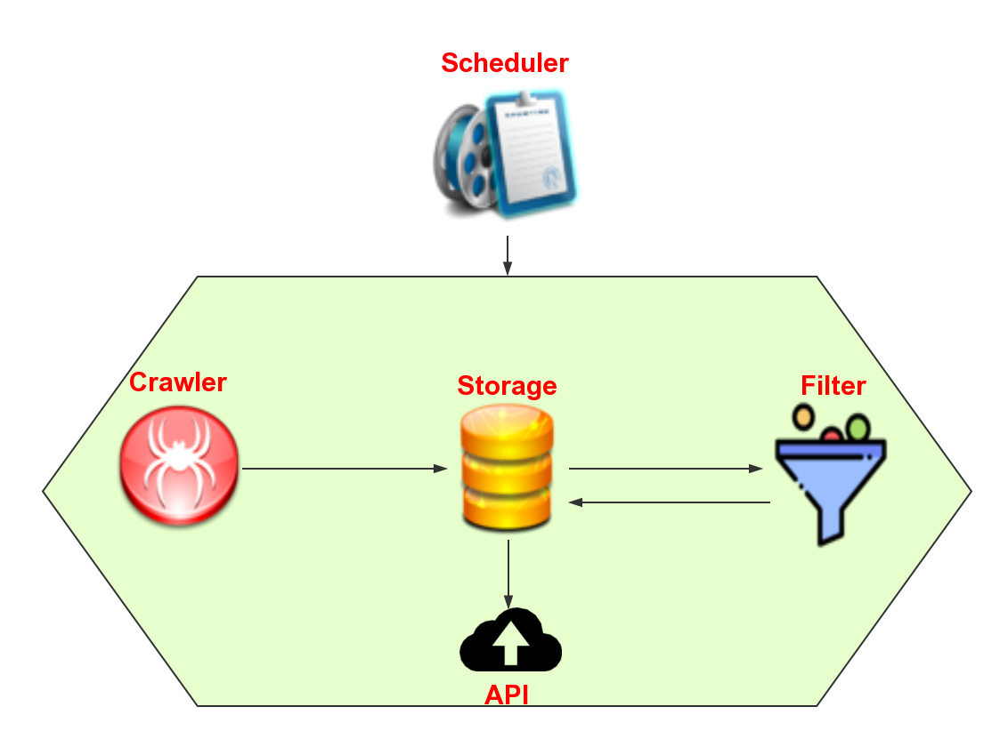
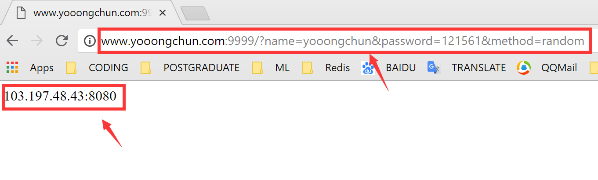
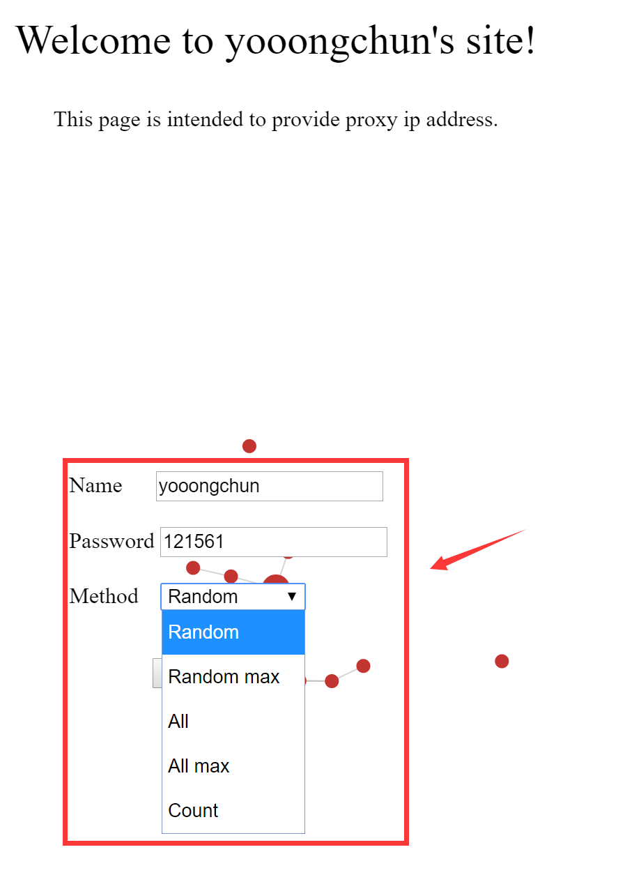

### IP代理池

---

#### 概述

该项目旨在提供批量免费的代理IP地址，思路参考自作者崔庆才的书籍《Python3 网络爬虫开发实战》第九章--代理的使用--代理池的维护，在此感谢作者的无私贡献！项目的分模块思想借鉴了作者的思路，但代码实现不同。

#### 功能模块

程序分为5个模块，分别为：

- 抓取模块：负责从给定的网站上抓取代理IP地址
- 存储模块：负责存储IP地址
- 验证模块：负责定时验证数据库中代理IP地址的有效性
- API模块：通过网络端口的形式对外提供调用
- 调度模块：负责控制上述4个模块的有序运行

模块之间的关系示意如下：



#### 如何使用？

程序在运行中不断将抓取到的IP存入数据库中，然后验证模块定时验证IP地址的有效性；一旦测试有效，会设定score=100（最大值），而无效则会对score减一，当减到score小于0则删除，初始加入时score为10。

程序通过API模块对外提供调用，要获取代理IP地址，有两种方式可访问：

- 第一种：使用Get请求：

  ```python
  http://www.yooongchun.com:9999/?name=yooongchun&password=121561&method=random
  ```

  这里name参数和password参数是为了验证身份，必须填写正确；method参数可以选择的值有以下几种：

  - method=random ：随机从数据库中返回一个IP地址
  - method=random_max:随机从数据库中返回一个score=100的IP地址
  - method=all：返回数据库中的所有IP地址
  - method=all_max：返回数据库中所有score=100的IP地址
  - method=count: 返回数据库中的IP地址数目

  一个示意的请求结果如下：

  

  

- 第二种：使用Post请求：

  ```python
  http://www.yooongchun.com:9999
  ```

  访问该页面会要求填写一个表单注意填写信息如下：

  ```python
  name:yooongchun
  password:121561
  method:任意选择一种，其意思如上述method所讲
  ```

  请求进入的界面如下：

  

#### 获取帮助

有任何问题，你可以通过以下方式给我留言：

- 微信：18217235290
- QQ：1729465178
- 微信公众号：yooongchun小屋
- Email：yooongchun@foxmail.com

#### 项目Github地址

  https://github.com/yooongchun/Proxy

  
